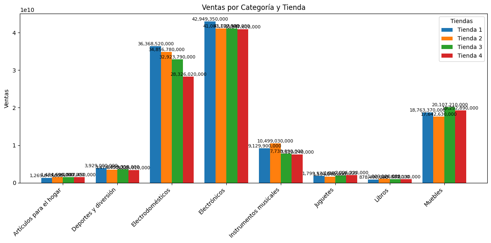

# Reporte de hallazgos

## Description del informe

Con base en los análisis realizados y los gráficos generados, es momento de sintetizar sus hallazgos en un informe final.

Esctructura del informe:

    Introducción que explique el propósito del análisis

    Desarrollo con la presentación de datos y gráficos

        Los ingresos totales de las tiendas.

        Las categorías de productos más y menos vendidas.

        Las calificaciones promedio de los clientes por tienda.

        Los productos más y menos vendidos.

        El coste de envío promedio para cada tienda.

    Conclusión recomendando la tienda que se debe vender:

        Justificación su decisión, respaldada por el análisis y las visualizaciones que generó.

        Explicar, de forma clara y objetiva, las razones por las que una tienda destaca (o no) en relación a las demás,

        Considere las fortalezas y debilidades de cada una.

## Introducción que explique el propósito del análisis

Tenioendo en cuenta el análisis de datos aplicado al mundo de las ventas minoristas. el objetivo del siguiente informe será
suministrar informacion clara y de ayuda al señor Juan para tomar una decisión estratégica sobre cuál de sus tiendas debe
vender para invertir en un nuevo negocio.

Por lo tanto la Pregunta de negocio a resolver es:

 **Con on base en la data suministrada por el cliente y su respectivo analisis, cuál de sus tiendas debe vender para**
 **invertir en un nuevo negocio**

## Desarrollo con la presentación de datos y gráficos

## Conclusiónes

Inicialmente se mmuestra en la grafica de salida del analisis de facturacion que la tienda 4, presenta los menores rendimientos del conjunto de tiendas,
aunque no es un dato total es un dato para tener en cuenta ya que el analisis de facturacion la ubica por debajo de las demas tiendas de la compañia, con lo cual
podemos empezar a inferir que estamos teniendo menos ventas y gastos constantes con respectoa las demas tiendas

En el caso de los costes de envios asociados la tienda numero 4 presenta los menores costos, pero puede deberse a sus bajas ventas y la tienda numero 1, presenta los mayores
costos pero tambien las mayores ventas en facturacion asi que aun no es determinante estas dos variables para la toma de una decision.

La valoracion de tienda la tienda numero 4 se mantiene en el promedio y la nuemro 1 pasa a ser la peor calificada del conjunto, pero sigue aportando la mayor facturacion, por lo tanto un analisis de costos de envio quizas nos lleve a mejorar la relacion con los clientes, pero este seria tema de una analisis much mas detallado de estas variables

Las ventas por categoria, al comparar las categorias por tienda se evidencia que la tienda numero 4 se queda muy por detras de las demas tiendas, generando bajas ventas, costos adicionales de envios y gastos asociados a la operacion

Por lo tanto si con esta data tuvieramos que emitir un concepto, nuestro cliente deberia liquidar la tienda numero 4 dados los datos que tenemos y la informacion que estos nos estan aportando